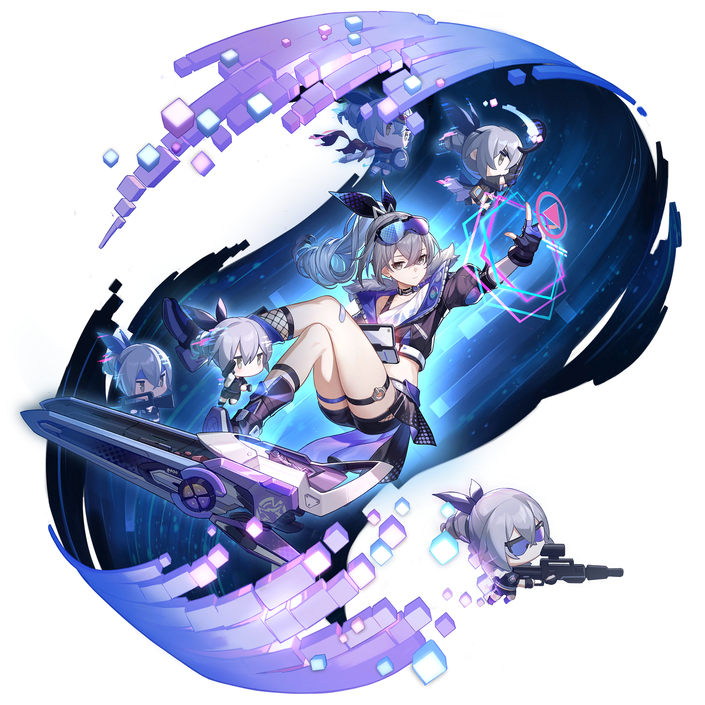

<div align="center">


# SilverWolf-Lv-999


<br />
<br />


<a href="https://gitee.com/daichangs_mc"></a>

</div>

---

## 刚上线，别急


```txt
name   SilverWolf-Lv-999
gitee  daichangs_mc
mood   有点困，但还能写
style  银狼 / 赛博 / 二次元 / 摸鱼中
quest  想到什么就做点什么
save   自动存档，大概
```

这里是我的主页。

写点代码，打点游戏，偶尔把脑子里的小想法丢进仓库里。
更新频率看心情，项目进度看灵感，bug 看缘分。

<br clear="right" />

## 随身小包

<div align="center">


<a href="https://github.com/SilverWolf-Lv-999"></a>
<a href="https://gitee.com/daichangs_mc"></a>


</div>

## 摸鱼面板

<table>
  <tr>
    <td colspan="2" align="center">
      <a href="https://github.com/SilverWolf-Lv-999"></a>
      <a href="https://gitee.com/daichangs_mc"></a>
    </td>
  </tr>
  <tr>
    <td width="52%">
      <h3 align="center">GitHub 活跃度</h3>
      
    </td>
    <td width="48%">
      <h3 align="center">语言偏好</h3>
      
    </td>
  </tr>
  <tr>
    <td width="52%">
      <h3 align="center">当前频道</h3>
      <pre>
github  随手丢点代码
gitee   国内也留个入口
status  懒得动，但在线
update  看心情，别催</pre>
    </td>
    <td width="48%" align="center">
      
    </td>
  </tr>
</table>

## 退出前存个档

```txt
[ok]   主页加载完成
[zzz]  今日能量不足，先挂后台
[todo] 想起来再更新
[tip]  不要问进度，问就是在跑了
```

<div align="center">


<sub>
Decorative assets:
<a href="https://honkai-star-rail.fandom.com/wiki/File:Character_Silver_Wolf_Icon.png">icon</a>,
<a href="https://honkai-star-rail.fandom.com/wiki/File:Character_Silver_Wolf_Splash_Art.png">splash art</a>,
<a href="https://honkai-star-rail.fandom.com/wiki/File:Sticker_PPG_02_Silver_Wolf_01.png">sticker</a>.
Silver Wolf belongs to HoYoverse.
</sub>

</div>
